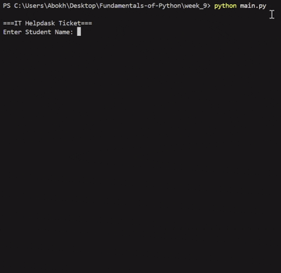

# IT Helpdesk Ticket System

An intuitive, command-line-based IT ticketing application written in Python. This tool allows users to quickly log technical support requests, collects necessary diagnostic details, and automatically assigns a responsible technician based on the severity level of the reported issue.

---

### 4.1 Purpose of the application

The **IT Helpdesk Ticket System** was developed to streamline the initial intake and triage process for campus or workplace technical support requests. 

* **Standardize Data Collection:** Prompts users for consistent details including student/user identification, location, and issue description to eliminate missing context.
* **Automated Triage:** Dynamically assigns an appropriate technician based on the specified priority level (`high`, `medium`, or `low`).
* **Modular Architecture:** Demonstrates clean Python programming practices by splitting user input, business logic, and program execution into distinct, reusable modules (`main.py`, `display.py`, `ticket.py`).
* **Error Resilience:** Incorporates robust exception handling (`try...except`) to ensure smooth execution and user-friendly error reporting during runtime errors.

---

### 4.2 Tech Stack

* **Programming Language:** Python 3.x
* **Core Concepts & Architecture:**
  * **Modular Design:** Function separation across imports (`main.py`, `display.py`, and `ticket.py`).
  * **Control Flow Logic:** Conditional evaluation (`if-elif-else`) for dynamic technician assignment.
  * **Exception Handling:** `try...except` blocks for runtime error capturing.
  * **String Formatting:** Formatted string literals (f-strings) for dynamic console output.

---

### 4.3. How to use

#### 1. Prerequisites
Ensure Python 3 is installed on your local system. You can verify your installation by running:
```bash
python --version   # Windows


4.4. Demonstrate the application using screen recording (Video/GIF Format)


